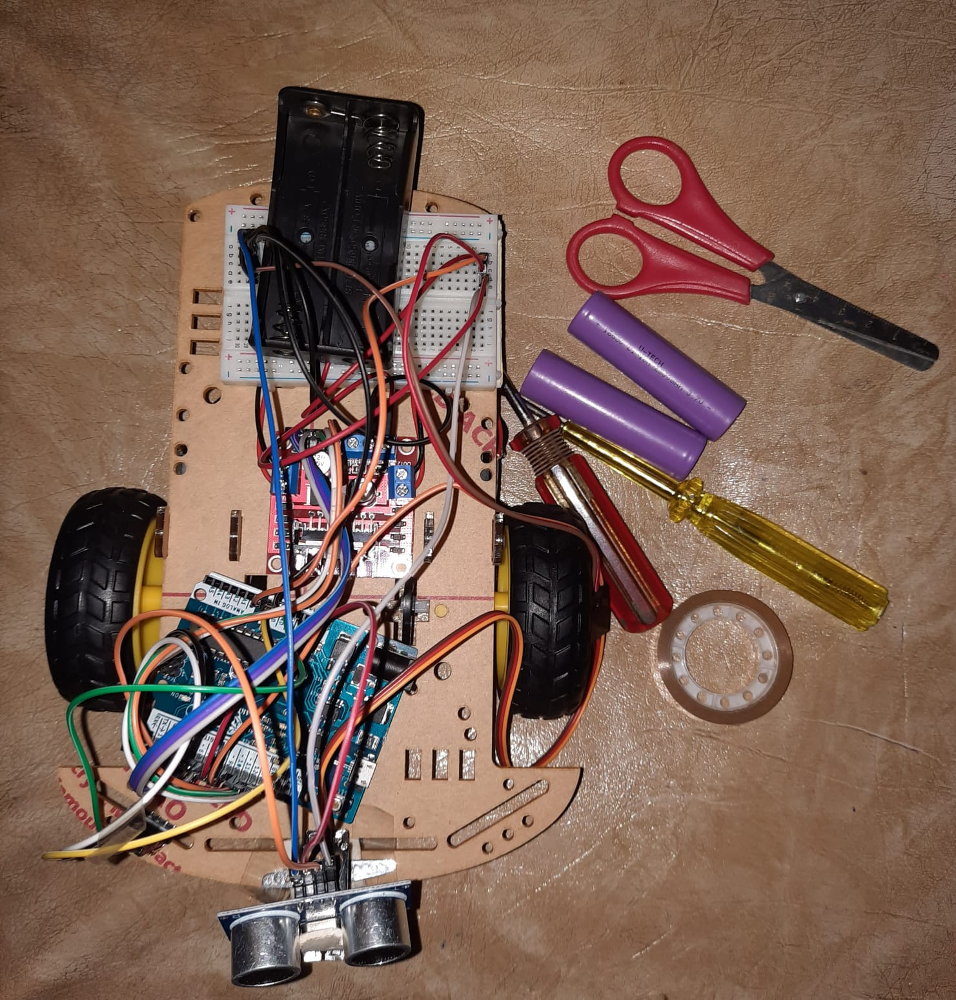
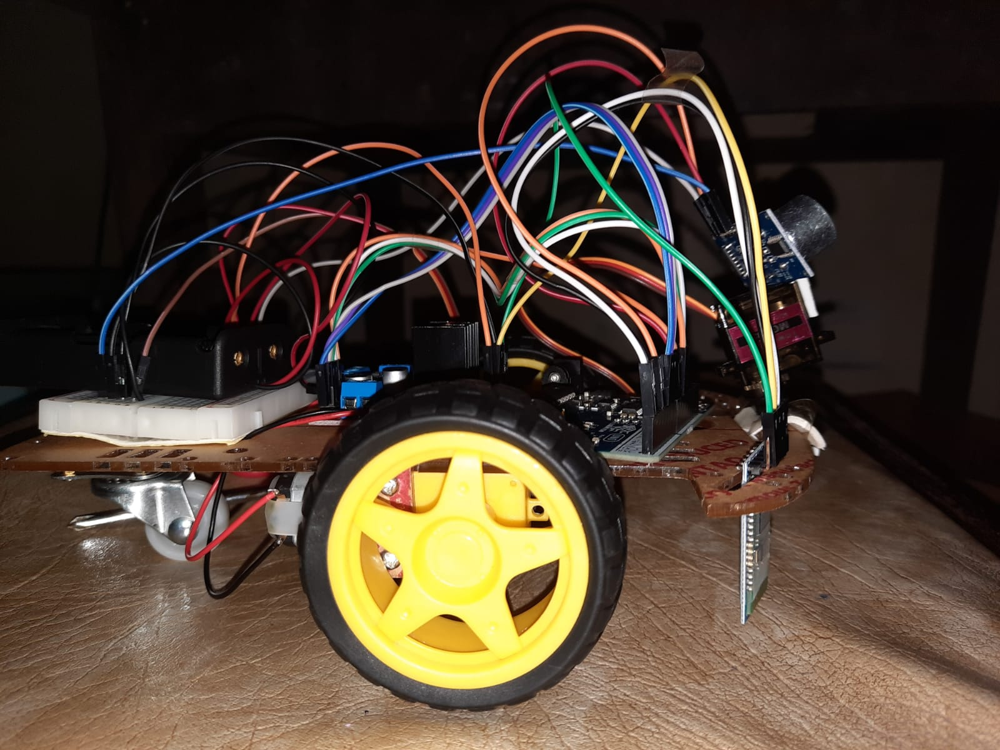
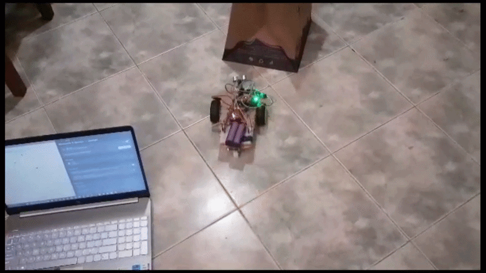
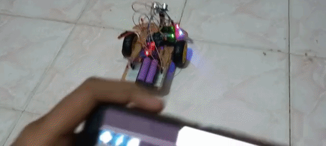

# 🤖 Bluetooth-Controlled-Mobile-Robot-with-Sensor-Based-Collision-Avoidance
This is an individual project on a Bluetooth-controlled robot with ultrasonic collision avoidance, featuring a custom Java Swing control interface and mobile app teleoperation.

The system allows a user to control the robot using either:

* 💻 a **custom Java desktop controller**
* 📱 a **mobile Bluetooth control interface**

An onboard ultrasonic sensor continuously monitors obstacles and prevents forward motion when a collision risk is detected.

---

# 📸 Robot Overview

<p align="center">
  
  
</p>

---

# 🎥 Demonstrations

### 💻 Desktop Bluetooth Control (Java GUI)



Custom control software developed using **Java Swing**, sending directional commands over Bluetooth.

---

### 📱 Mobile Bluetooth Control



A mobile interface created using **Bluetooth Electronics**, enabling wireless robot navigation via smartphone.

---

# 🧠 System Concept

The robot combines **user teleoperation** with **local safety logic**.

Even if the user commands the robot to move forward, the onboard system will **block the motion if an obstacle is detected within a safety threshold**.

This architecture demonstrates a **hybrid control strategy**:

```
User Command  →  Bluetooth Module  →  Microcontroller
                                      ↓
                           Safety Check (Ultrasonic Sensor)
                                      ↓
                            Motor Controller Execution
```

This ensures the robot maintains **collision awareness during remote control**.

---

# ⚙️ Key Features

🚗 **Wireless Teleoperation**
Control the robot remotely via Bluetooth.

🖥 **Custom Desktop Controller**
Java Swing application with directional control interface.

📱 **Mobile Control Support**
Alternative mobile interface for portable operation.

📡 **Serial Bluetooth Communication**
Lightweight command protocol between controller and robot.

🛑 **Sensor-Based Collision Prevention**
Forward motion blocked when obstacle distance < threshold.

🔄 **Servo-Mounted Sensor Scanning**
Sensor rotates to check left/right before turns.

---

# 🏗 System Architecture

```
Desktop GUI / Mobile App
           │
           │ Bluetooth Commands
           ▼
Bluetooth Module
           │
           ▼
Microcontroller
           │
           ├── Ultrasonic Distance Sensor
           ├── Servo Motor (sensor orientation)
           └── Motor Driver
                   │
                   ▼
               DC Motors
```

---

# 🧑‍💻 Desktop Controller

The robot can be controlled using a **custom GUI developed with Java Swing**.

### Features

* Directional control buttons
* Bluetooth device communication
* Real-time command transmission

Example command protocol:

| Command | Action       |
| ------- | ------------ |
| `1`     | Move Forward |
| `2`     | Turn Left    |
| `3`     | Turn Right   |
| `4`     | Reverse      |

The interface sends commands directly to the robot through Bluetooth serial communication.

---

# 📡 Embedded Control Logic

The firmware implements a **simple decision layer** to ensure safe movement.
This prevents the robot from moving forward into obstacles even when commanded remotely.

---

# 🧰 Technologies Used

### Embedded Systems

* Embedded C / Arduino firmware
* Serial communication
* Sensor-based decision logic

### Software

* Java
* Java Swing GUI development

### Communication

* Bluetooth serial communication

### Mechatronics

* DC motor control
* Sensor-based environment interaction

---
